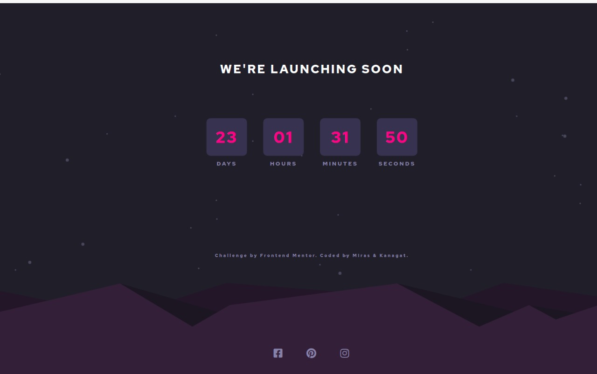

### Screenshot

## Welcome! 👋
Thanks for checking out this front-end coding challenge.

### Links

- Solution URL: [Add solution URL here](https://github.com/zxclinical/projectwork2)
- Live Site URL: [Add live site URL here](https://zxclinical.github.io/projectwork2)

## My process

### Built with
To do this challenge, we had to be well versed in HTML, CSS, and JavaScript.

- Semantic HTML5 markup
- CSS custom properties
- Flexbox
- Mobile-first workflow
- JS

### What I learned

We learned how to use and manipulate Date in JS, basics of responsible web-design

## Author

- https://www.frontendmentor.io/profile/zxclinical , https://github.com/zxclinical- Miras
- https://www.frontendmentor.io/profile/zhumagalievv , https://github.com/zhumagalievv - Kanagat

## Acknowledgments

We helped each other, our profiles can be found in the Authors section

